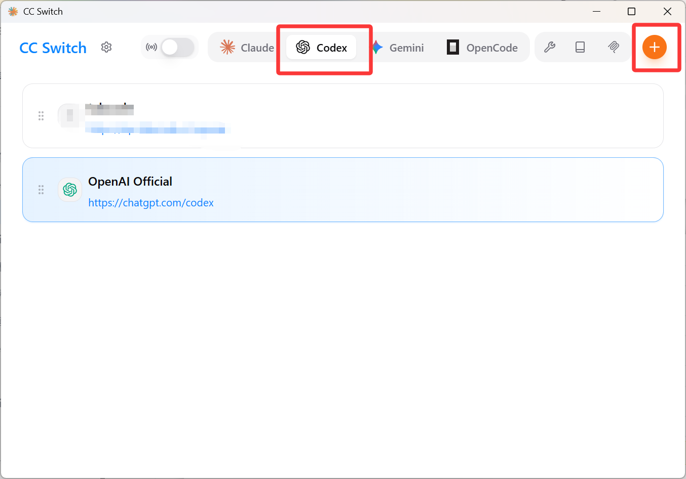
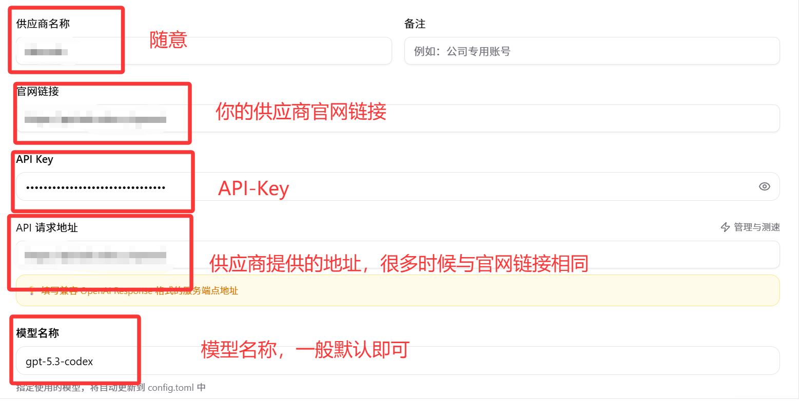
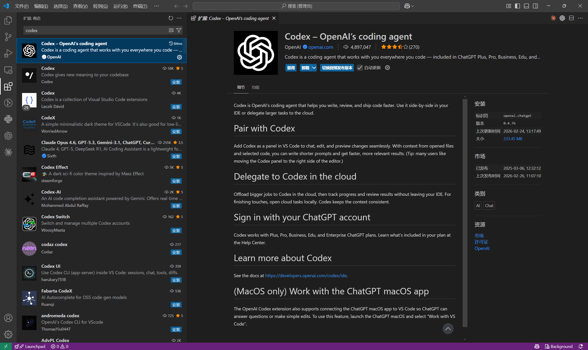

# Windows 上 Codex 配置与使用完整指南（零基础详实版）


这是一份可直接执行的 **Windows Codex 配置文档**。按顺序操作后，可以完成：

1. Git / Node.js / Codex CLI / cc-switch安装
2. 两种认证方式（账号登录 / API Key）
3. 在 IDE（PyCharm / VS Code）中稳定使用

参考csdn文章"https://blog.csdn.net/bynacqt/article/details/157184215"的配置，主要补充了ide使用方面。本文省略了一些具体步骤，若需要更详细的教程可以参考该csdn文章。
---

## 目录

- [一、你将获得什么结果](#一你将获得什么结果)
- [二、开始前准备](#二开始前准备)
- [三、步骤 1：安装 Git](#三步骤-1安装-git)
- [四、步骤 2：安装 Node.js（LTS）](#四步骤-2安装-nodejslts)
- [五、步骤 3：安装 Codex CLI](#五步骤-3安装-codex-cli)
- [六、步骤 4：认证方式 A（账号登录）](#六步骤-4认证方式-a账号登录)
- [七、步骤 5：认证方式 B（API Key）](#七步骤-5认证方式-bapi-key)
- [八、步骤 6：在 IDE 中使用 Codex](#八步骤-6在-ide-中使用-codex)
- [九、日常使用建议](#九日常使用建议)
- [十、一页检查清单（最终验收）](#十一页检查清单最终验收)

---

## 一、目标结果

完成本文全部流程后，你应该满足以下状态：

- 在任意终端执行 `codex --version`，能看到版本号
- 执行 `codex`，能进入可交互会话，不会停在未认证状态
- 在项目目录的 IDE 终端里，能直接用 Codex 帮你做任务

---

## 二、开始前准备

### 1) 系统与网络

- 操作系统：Windows 10 / 11
- 网络：需要访问 OpenAI 相关服务
- 终端：PowerShell 或 CMD 均可

### 2) 本指南用到的软件

必须先后安装：

1. Git
2. Node.js（LTS）
3. Codex CLI（通过 npm 安装）

### 3) 建议操作习惯（重要）

- 安装后务必做“命令验证”，不要只看安装向导结束
- 每安装完一个组件，就在新终端窗口再测一次
- 出现问题时，先确认命令能否输出版本号，再继续下一步

---

## 三、步骤 1：安装 Git

### 1) 下载与安装

- 打开官方下载页：`https://git-scm.com/download/win`
- 下载后双击安装
- 安装选项一般使用默认值即可

### 2) 安装验证

打开 PowerShell 或 CMD，执行：

```bash
git --version
```

看到类似 `git version 2.x.x` 就说明安装生效。

---

## 四、步骤 2：安装 Node.js（LTS）

### 1) 下载与安装

- 打开官方下载页：`https://nodejs.org/`
- 选择 LTS 版本下载并安装
- 安装过程中如果出现：
  `Automatically install the necessary tools. Note that this will also install Chocolatey...`
  建议选择 **Yes**，这样会自动补齐常用构建工具依赖

### 2) 安装验证

执行：

```bash
node -v
npm -v
```

两条命令都输出版本号，才算 Node 环境可用。

---

## 五、步骤 3：安装 Codex CLI

### 1) 全局安装

执行：

```bash
npm install -g @openai/codex
```

### 2) 安装验证

执行：

```bash
codex --version
```

若输出版本号，表示 Codex CLI 已安装成功。

---

## 六、步骤 4：认证方式 A（账号登录）

适合人群：有 ChatGPT 账号，希望最少配置快速用起来。

### 1) 首次登录

执行：

```bash
codex
```

终端会给出登录引导，通常会让你在浏览器打开授权页面。完成授权后回到终端。

### 2) 验证是否真正登录成功

再次执行：

```bash
codex
```

如果能直接进入会话并正常交互（例如发送 `hello` 有回复），说明账号登录链路已经打通。

### 3) 切换账号

如果后续想换账号，执行：

```bash
codex login
```

---

## 七、步骤 5：认证方式 B（API Key）

适合人群：

- 已有可用 API Key
- 需要更规范、可控的环境变量配置
- 团队内做统一环境分发

本节给出两种可落地方案，任选其一。

### 方案 B1：环境变量方式

#### 1) PowerShell（当前窗口生效）

```powershell
$env:OPENAI_API_KEY = "你的_API_Key"
```

说明：只对当前打开的这个 PowerShell 窗口有效，关掉后失效。

#### 2) PowerShell（当前用户永久生效）

```powershell
[Environment]::SetEnvironmentVariable("OPENAI_API_KEY", "你的_API_Key", "User")
```

说明：这是写入用户级环境变量，重启终端后继续有效。

#### 3) CMD（当前窗口生效）

```bat
set OPENAI_API_KEY=你的_API_Key
```

说明：与 PowerShell 临时方式一样，仅当前 CMD 窗口有效。

#### 4) 验证是否生效

关闭当前终端，重新打开一个新终端，执行：

```bash
codex
```

如果能进入会话并正常响应，API Key 方案已完成。

### 方案 B2：CC-switch 管理方式（推荐）

项目地址：`https://github.com/farion1231/cc-switch`

#### 1) 下载

- 进入仓库 Release 页面
- 下载与你系统匹配的版本

#### 2) 添加 Codex 配置（示例图 1）

<p align="center">
  
</p>

#### 3) 按示例填写参数并保存（示例图 2）

<p align="center">
  
</p>

#### 4) 验证

在 PowerShell 执行：

```bash
codex
```

发送一个简单任务（例如“hello”或“帮我解释当前目录”），有正常输出就说明配置可用。

---

## 八、步骤 6：在 IDE 中使用 Codex

核心原则：**先打开项目目录，再在 IDE 内置终端运行 `codex`**。

### 1) PyCharm / VS Code 通用流程

1. 打开你的项目文件夹
2. 打开内置终端（Terminal）
3. 在终端执行：

```bash
codex
```

4. 直接输入你的任务描述，开始协作

### 2) VS Code 示例图

<p align="center">
  
</p>

### 3) OpenCode（第三方供应商）补充

如果你走第三方供应商链路，一般会有这些差异：

- 需要手动设置模型名称
- `base URL` 可能不是默认值
- 一些供应商要求 URL 额外追加路径（例如 `/v1`）

这部分以你实际供应商文档为准。

---

## 九、日常使用建议

每次开始开发前，建议按这 5 步执行：

1. 确认你在正确项目目录
2. 打开 IDE 终端
3. 执行 `codex`
4. 用一句话描述任务目标
5. 先评估建议，再执行修改

这样可以减少“目录错误 / 认证未生效 / 输出与项目不匹配”等常见问题。

---

## 十、一页检查清单（最终验收）

- [ ] `git --version` 输出版本号
- [ ] `node -v` 与 `npm -v` 输出版本号
- [ ] `codex --version` 输出版本号
- [ ] 我已完成至少一种认证方式（账号登录或 API Key）
- [ ] 在项目目录执行 `codex` 能进入会话
- [ ] 我知道切换账号命令：`codex login`

全部勾选完成后，环境即可用于日常开发。

---

## 备注

- 当前仓库只保留一个主页文档：`README.md`
- 图片资源位于 `docs/` 目录，用于 README 展示
