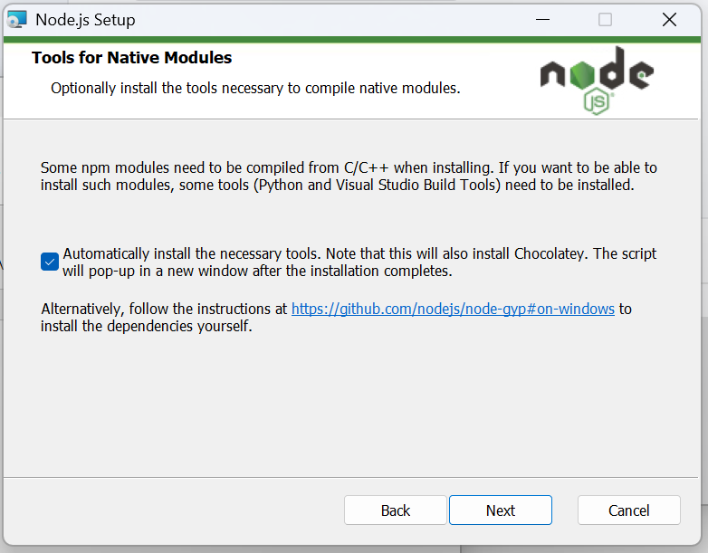
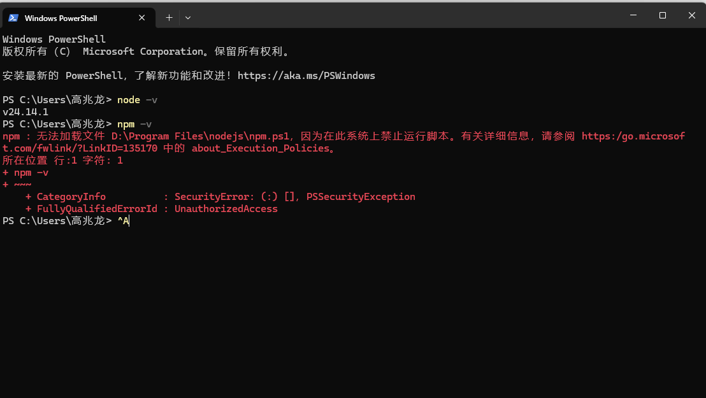
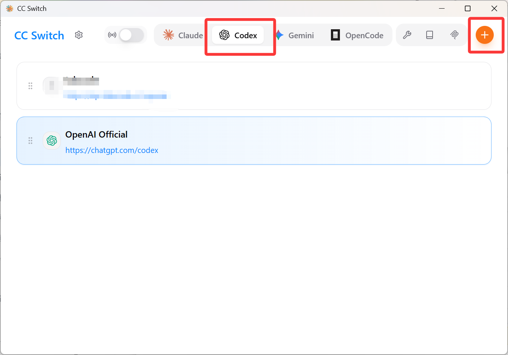
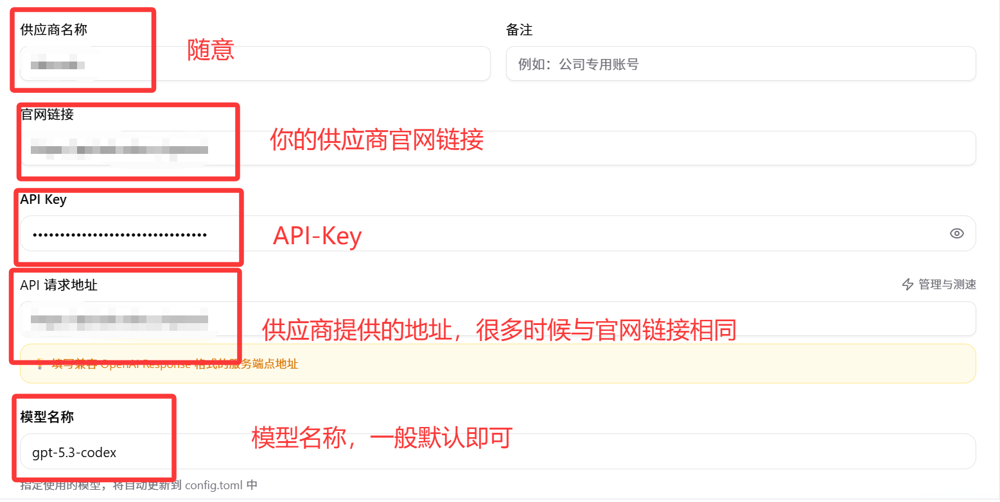

# Windows 上安装和使用 Codex

本文说明如何在 Windows 10/11 上安装 Git、Node.js 和 Codex CLI，并在 VS Code 或 PyCharm 的项目终端中使用 Codex。

## 目录

- [一、完成标准](#一完成标准)
- [二、环境准备](#二环境准备)
- [三、安装 Git](#三安装-git)
- [四、安装 Node.js LTS](#四安装-nodejs-lts)
- [五、安装 Codex CLI](#五安装-codex-cli)
- [六、登录与 API Key 配置](#六登录与-api-key-配置)
- [七、在 IDE 中使用 Codex](#七在-ide-中使用-codex)
- [八、常见问题](#八常见问题)
- [九、验收清单](#九验收清单)
- [十、参考资料](#十参考资料)

---

## 一、完成标准

完成本文后，应满足以下条件：

- `git --version` 可以输出版本号。
- `node -v` 和 `npm -v` 可以输出版本号。
- `codex --version` 可以输出版本号。
- `codex login status` 可以显示已登录。
- 在项目目录执行 `codex` 可以进入会话。

---

## 二、环境准备

- 操作系统：Windows 10 或 Windows 11
- 终端：PowerShell 或 CMD
- 网络：需要能够访问 OpenAI 相关服务

建议按以下顺序安装：

1. Git
2. Node.js LTS
3. Codex CLI

---

## 三、安装 Git

下载地址：

[https://git-scm.com/download/win](https://git-scm.com/download/win)

安装时大部分选项保持默认即可。

安装完成后，在新的终端执行：

```bash
git --version
```

看到类似下面的输出即表示安装成功：

```text
git version 2.x.x.windows.x
```

---

## 四、安装 Node.js LTS

下载地址：

[https://nodejs.org/](https://nodejs.org/)

请选择当前 LTS 版本。

安装过程中如果出现 “Tools for Native Modules” 页面，建议保持勾选。这样后续安装带原生依赖的 npm 包时更省事。

<p align="center">
  
</p>

安装完成后，在新的终端执行：

```bash
node -v
npm -v
```

两条命令都能输出版本号即可。

---

## 五、安装 Codex CLI

在终端执行：

```bash
npm install -g @openai/codex
```

安装完成后执行：

```bash
codex --version
```

如果可以输出版本号，说明安装成功。

### 常见报错：`npm.ps1 cannot be loaded`

Windows 上常见问题是 PowerShell 拦截 `npm.ps1` 脚本。典型报错如下：

<p align="center">
  
</p>

先查看当前执行策略：

```powershell
Get-ExecutionPolicy -List
```

如需为当前用户放开常用脚本执行，可执行：

```powershell
Set-ExecutionPolicy -ExecutionPolicy RemoteSigned -Scope CurrentUser
```

然后关闭终端，重新打开，再执行：

```bash
npm -v
npm install -g @openai/codex
```

如果电脑受公司策略管理，以上命令可能不会生效。这种情况优先联系管理员，或先用 `CMD` 完成安装。

---

## 六、登录与 API Key 配置

### 方案 A：账号登录

如果你使用 OpenAI 官方服务，优先使用账号登录。

执行：

```bash
codex
```

按终端和浏览器提示完成授权。

如果浏览器没有自动打开，可以执行：

```bash
codex login --device-auth
```

登录完成后执行：

```bash
codex login status
```

如果显示已登录，再执行一次：

```bash
codex
```

可以正常进入会话即可。

如果需要重新登录，可执行：

```bash
codex logout
```

### 方案 B：API Key

#### B1. 官方 API Key

如果你使用的是 OpenAI 官方 API Key，可以直接登录：

```powershell
$env:OPENAI_API_KEY = "你的_API_Key"
$env:OPENAI_API_KEY | codex login --with-api-key
```

如果希望写入当前用户环境变量，可执行：

```powershell
[Environment]::SetEnvironmentVariable("OPENAI_API_KEY", "你的_API_Key", "User")
$env:OPENAI_API_KEY = [Environment]::GetEnvironmentVariable("OPENAI_API_KEY", "User")
$env:OPENAI_API_KEY | codex login --with-api-key
```

然后执行：

```bash
codex login status
codex
```

#### B2. 中转站或第三方兼容接口：优先使用 `cc-switch`

这一种只在中转站或第三方兼容 OpenAI 接口时需要。官方账号登录和官方 API Key 不需要 `cc-switch`。

项目地址：

[https://github.com/farion1231/cc-switch](https://github.com/farion1231/cc-switch)

基本步骤如下：

1. 从 Releases 页面下载与你系统匹配的版本。
2. 新建一个 Codex 配置。

<p align="center">
  
</p>

3. 填写供应商参数并保存。

<p align="center">
  
</p>

需要注意的字段只有这几个：

- 供应商名称：自定义即可。
- API Key：填写供应商提供的 Key。
- API 请求地址：按供应商文档填写，很多情况下需要带 `/v1`。
- 模型名称：按供应商文档填写。

保存后执行：

```bash
codex
```

可以正常进入会话即可。

---

## 七、在 IDE 中使用 Codex

本教程推荐直接在 IDE 内置终端里使用 Codex。

操作步骤：

1. 用 VS Code 或 PyCharm 打开项目目录。
2. 打开内置终端。
3. 确认当前目录是项目根目录。
4. 执行：

```bash
codex
```

这样可以直接在当前项目上下文中使用 Codex。

---

## 八、常见问题

### 1. `codex` 命令找不到

先关闭终端，再打开一个新的终端，然后重新执行：

```bash
codex --version
```

如果仍然找不到，检查 npm 全局安装路径是否已加入 `PATH`。

### 2. 浏览器登录没有弹出

执行：

```bash
codex login --device-auth
```

### 3. 已设置环境变量，但 API Key 仍未生效

不要只设置环境变量，建议再执行一次登录命令：

```powershell
$env:OPENAI_API_KEY | codex login --with-api-key
```

然后用 `codex login status` 检查状态。

---

## 九、验收清单

- [ ] `git --version` 可以输出版本号。
- [ ] `node -v` 和 `npm -v` 可以输出版本号。
- [ ] `codex --version` 可以输出版本号。
- [ ] `codex login status` 显示已登录。
- [ ] 在项目目录执行 `codex` 可以进入会话。

---

## 十、参考资料

- [OpenAI Developers: Codex on Windows](https://developers.openai.com/codex/windows)
- [OpenAI Developers: Codex CLI Reference](https://developers.openai.com/codex/cli/reference)
- [Microsoft Learn: about_Execution_Policies](https://learn.microsoft.com/powershell/module/microsoft.powershell.core/about/about_execution_policies)
- [Git for Windows](https://git-scm.com/download/win)
- [Node.js](https://nodejs.org/)
- [cc-switch GitHub 仓库](https://github.com/farion1231/cc-switch)

---

图片资源位于 `docs/images/`，均为相对路径引用，可直接用于 GitHub。
